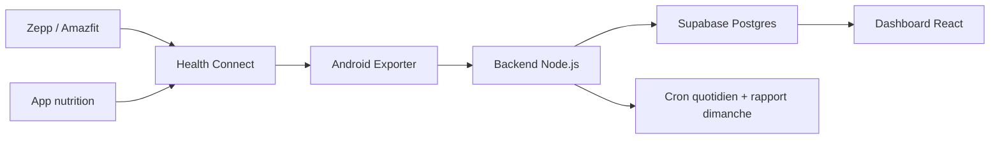

# Architecture

## Objectif

Construire un outil personnel de suivi poids, sommeil, activite, effort et nutrition avec une collecte quotidienne automatique.

## Composants

## Responsabilites

### Zepp

Zepp reste la source primaire pour :

- pas ;
- sommeil ;
- activite ;
- effort ;
- cardio ;
- poids si balance compatible.

Zepp doit ecrire ses donnees dans Android Health Connect.

### Health Connect

Health Connect est le hub local Android.

Important : Health Connect ne peut pas etre lu directement par le backend Node.js. Les donnees restent sur le telephone. Il faut une app Android pour lire les donnees puis appeler l'API.

### Android Exporter

Le module `android-exporter/` :

- demande les permissions Health Connect ;
- lit les aggregats de la veille ;
- transforme les donnees en payload JSON ;
- appelle `/api/ingest/health-connect` ;
- peut planifier une synchro quotidienne via WorkManager.

### Backend

Le module `backend/` :

- expose l'API d'ingestion ;
- upsert les mesures dans Supabase ;
- recalcule les resumes quotidiens ;
- genere les rapports hebdomadaires ;
- execute les cron si `RUN_CRON=true`.

### Supabase

Supabase stocke :

- les metriques journalieres brutes ;
- les resumes journaliers ;
- les rapports hebdomadaires ;
- les sources de donnees.

### Dashboard

Le module `dashboard/` lit Supabase avec la cle anon et affiche :

- cartes KPI ;
- tendances 30 jours ;
- objectifs du jour ;
- nutrition ;
- sommeil ;
- activite ;
- analyse intelligente ;
- dernier rapport hebdomadaire.

## Choix techniques

- Node.js pour le backend : simple a deployer et coherent avec le dashboard.
- Supabase pour le stockage : Postgres, API JS et RLS.
- React/Vite pour le dashboard : rapide et simple.
- Kotlin/Compose pour Android : acces natif Health Connect et WorkManager.
- Payload long `metric/value/unit` : extensible sans changer le schema a chaque nouvelle metrique.

## Limites connues

- La lecture en arriere-plan Health Connect depend de la version Android/Health Connect et de la permission correspondante.
- Les donnees nutrition existent seulement si une app nutrition les ecrit dans Health Connect.
- Les calories actives restent des estimations. La tendance du poids moyen reste l'indicateur principal.
- Le telephone ne peut pas appeler `localhost`. Il faut une URL publique, une IP LAN ou un tunnel.
