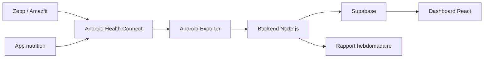

# Personal Trainer

Personal Trainer est un workflow complet pour centraliser tes donnees Zepp/Amazfit via Health Connect, les stocker dans Supabase, les analyser avec un backend Node.js, les afficher dans un dashboard React et automatiser un rapport hebdomadaire.

## Point d'entree

Lis d'abord :

- [DOCUMENTATION.md](DOCUMENTATION.md) : index general de toute la documentation.
- [ARCHITECTURE.md](ARCHITECTURE.md) : vue d'ensemble du systeme.
- [OPERATIONS.md](OPERATIONS.md) : routine quotidienne, commandes et verification.
- [todo.md](todo.md) : checklist de progression.

## Documentation par brique

- [SUPABASE.md](SUPABASE.md) : schema, tables, migrations et cron Supabase.
- [BACKEND.md](BACKEND.md) : API Node.js, ingestion, jobs et rapports.
- [DASHBOARD.md](DASHBOARD.md) : dashboard React/Vite.
- [ANDROID_EXPORTER.md](ANDROID_EXPORTER.md) : app Android Health Connect.
- [DATA_MODEL.md](DATA_MODEL.md) : metriques, payloads et format normalise.
- [ROADMAP.md](ROADMAP.md) : prochaines evolutions.

## Demarrage rapide

Installer les dependances :

```bash
npm install
```

Lancer le backend :

```bash
npm run dev:backend
```

Lancer le dashboard :

```bash
npm run dev:dashboard
```

Tester l'ingestion :

```bash
make test-ingest
```

Verifier tout ce qui est verifiable localement :

```bash
make check
```

## Flux cible



## Etat actuel

- Backend Node.js : en place.
- Supabase : schema en place.
- Dashboard React : en place.
- App Android Health Connect exporter : squelette fonctionnel en place, a tester sur telephone via Android Studio.
- Fallback CSV local : conserve dans `scripts/`.

## Dossiers principaux

- `backend/` : API, ingestion, jobs cron, rapport hebdomadaire.
- `dashboard/` : interface React.
- `android-exporter/` : app Android Health Connect.
- `supabase/` : migrations SQL.
- `scripts/` : outils CSV locaux.
- `docs/` : documentation detaillee et historique.
- `examples/` : payloads et exports d'exemple.
- `data/` : donnees locales generees.
