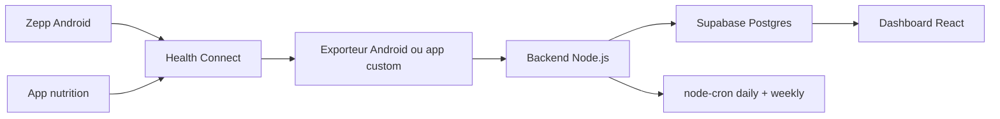

# Architecture retenue

## Decision

Le systeme lit les donnees Health Connect cote Android, puis envoie un payload quotidien vers une API Node.js. Le backend stocke les metriques dans Supabase, calcule les resumes quotidiens et genere un rapport hebdomadaire chaque dimanche.

## Pourquoi

Health Connect est une API Android locale : un backend Node.js ne peut pas la lire directement sur le telephone. Une app Android, une app d'export ou une automatisation mobile doit donc lire Health Connect avec les permissions utilisateur puis appeler l'API custom.

Supabase est utilise pour :

- stockage des mesures journalieres ;
- stockage des resumes agreges ;
- lecture directe depuis le dashboard React avec la cle anon ;
- execution optionnelle de cron via Supabase Cron si le backend est public.

## Flux



## Contrats

L'API accepte un format long, stable :

```json
{
  "date": "2026-04-29",
  "source": "health_connect",
  "metrics": [
    { "metric": "steps", "value": 9200, "unit": "count" },
    { "metric": "sleep_duration_min", "value": 452, "unit": "min" },
    { "metric": "weight_kg", "value": 90.8, "unit": "kg" }
  ]
}
```

Le format long evite de refaire le backend a chaque changement de colonnes dans l'export Android.
