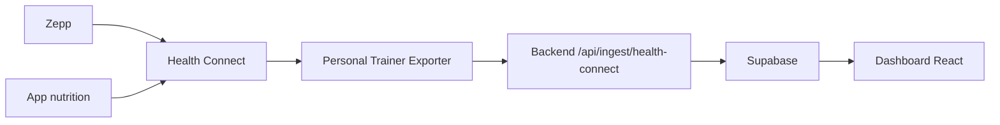

# App Android Health Connect Exporter

Le module `android-exporter/` contient l'app Android custom qui remplace l'export manuel Health Connect.

## Flux



## Premiere mise en route

1. Ouvrir `android-exporter/` dans Android Studio.
2. Installer l'app sur le telephone.
3. Dans Zepp, verifier l'ecriture vers Health Connect.
4. Dans l'app Android :
   - renseigner l'URL backend ;
   - renseigner `INGEST_API_KEY` ;
   - sauvegarder ;
   - accorder les permissions Health Connect ;
   - lancer une synchronisation manuelle.
5. Verifier Supabase.
6. Programmer la synchronisation quotidienne.

## Metriques envoyees

L'app envoie un payload compatible avec `docs/api.md`.

Exemple :

```json
{
  "date": "2026-04-29",
  "source": "health_connect",
  "metrics": [
    { "metric": "steps", "value": 9200, "unit": "count", "source": "health_connect" },
    { "metric": "sleep_duration_min", "value": 452, "unit": "min", "source": "health_connect" }
  ]
}
```

## Notes importantes

- Les pas et autres donnees cumulatives utilisent les aggregats Health Connect pour limiter les doubles comptages.
- Les donnees nutrition ne seront presentes que si une app nutrition ecrit dans Health Connect.
- Health Connect limite l'historique accessible par defaut autour du moment ou les permissions sont accordees. Pour le workflow quotidien, lire la veille suffit.
- La lecture en arriere-plan depend de la version Health Connect et d'une permission supplementaire.
