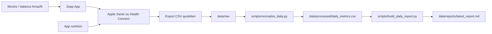

# Workflow Zepp quotidien

Objectif : recuperer chaque jour les donnees utiles a la perte de poids et a l'analyse du mode de vie, sans dependance fragile a une API privee.

## Donnees a recuperer

Priorite 1, tous les jours :

- Sommeil : duree totale, sommeil profond, REM, reveils, score.
- Activite : pas, distance, calories actives, minutes actives.
- Effort : entrainements, duree, calories, frequence cardiaque moyenne/max si disponible.
- Corps : poids, masse grasse si balance compatible.
- Nutrition : calories, proteines, glucides, lipides, fibres, eau.

Priorite 2, utile pour les correlations :

- Frequence cardiaque au repos.
- HRV si disponible.
- Stress, SpO2, PAI.
- Heure de coucher/reveil.

## Architecture recommandee



## Option Android

1. Dans Zepp, active les integrations disponibles vers Health Connect, Google Fit ou l'app compatible de ton ecosysteme.
2. Installe une app d'export Health Connect capable de sortir les donnees en CSV ou Google Sheets.
3. Configure un export quotidien, idealement apres la synchronisation du matin.
4. Fais arriver les fichiers dans `data/raw/`, par exemple avec Syncthing, Google Drive Desktop, rclone ou une copie manuelle au debut.
5. Lance les scripts :

```bash
python3 scripts/normalize_daily.py --input data/raw --output data/processed/daily_metrics.csv
python3 scripts/build_daily_report.py --input data/processed/daily_metrics.csv --output-dir data/reports
```

## Option iPhone

1. Dans Zepp, autorise l'ecriture vers Apple Sante.
2. Dans ton app nutrition, autorise aussi l'ecriture vers Apple Sante.
3. Utilise une app d'export Apple Sante ou un raccourci iOS pour exporter quotidiennement en CSV.
4. Synchronise le fichier exporte vers `data/raw/`.
5. Lance les memes scripts.

## Nutrition

La perte de poids depend surtout de la coherence entre depense, apport et recuperation. Le minimum fiable a suivre :

- calories journalieres ;
- proteines ;
- fibres ;
- eau ;
- poids du matin.

Si Zepp ne contient pas le detail alimentaire exploitable, utilise une app nutrition qui ecrit dans Apple Sante ou Health Connect. Le workflow local s'en fiche tant que l'export contient une date et des colonnes reconnues.

## Automatisation locale

Exemple cron quotidien a 08:15 :

```cron
15 8 * * * cd /home/aluxey/Workspace/PersonnalTrainer && python3 scripts/normalize_daily.py --input data/raw --output data/processed/daily_metrics.csv && python3 scripts/build_daily_report.py --input data/processed/daily_metrics.csv --output-dir data/reports
```

Sur Windows/WSL, tu peux aussi lancer cette commande via le Planificateur de taches Windows.

## Verification des donnees

Les premiers jours, verifie manuellement :

- le total de pas du rapport vs Zepp ;
- la duree de sommeil vs Zepp ;
- le poids vs Zepp ou ta balance ;
- les calories et proteines vs ton app nutrition.

Une fois les colonnes validees, le processus devient automatique.

## Limites importantes

- Les exports Zepp directs via demande de donnees personnelles sont utiles pour l'historique, mais pas toujours pratiques pour un suivi quotidien.
- Les API Zepp OS servent surtout aux apps sur montre et aux capteurs disponibles sur l'appareil, pas a un export cloud complet de ton historique personnel.
- Les integrations tierces Zepp peuvent varier selon pays, appareil, version de l'app et permissions.
- Les calories depensees par montre restent des estimations : pour la perte de poids, la tendance de poids sur 7 a 14 jours est plus fiable que la calorie depensee du jour.

## Routine d'analyse pour perte de poids

Regarde ces signaux chaque semaine :

- Moyenne de poids 7 jours : descend-elle au rythme vise ?
- Proteines : atteins-tu la cible la plupart des jours ?
- Pas : ton niveau d'activite hors sport est-il stable ?
- Sommeil : les nuits courtes precedent-elles les journees de faim ou de baisse d'activite ?
- Calories : les ecarts viennent-ils de quelques jours ou d'une moyenne trop haute ?

La bonne decision se prend sur les moyennes, pas sur une seule journee.
